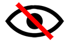

Eine Deutsche Version befindet sich weiter unten! - German version below!

## English Version

### What?

foo bar

### Why?

baz blah

### How?

lorem ipsum

### Authors and Contributors

Fix Windows Privacy has been initiated by Thorsten Schr&ouml;der (@devio) of modzero in 2016.
The software was inspired by the following websites:

* https://fix10.isleaked.com/
* http://www.c-amie.co.uk/technical/windows-10-registry-privacy-paths/
* https://www.windows-security.org/
* https://community.spiceworks.com/topic/1751004-some-useful-windows-10-anniversary-registry-values
* http://www.zdnet.com/article/windows-10-telemetry-secrets/

The program icon was originally created by http://www.danilodemarco.com/ and modified by @devio.

### License

Fix Windows Privacy is free and open source software. The software is published under the [BSD 2-Clause Licensxe](https://opensource.org/licenses/BSD-2-Clause).

### Download

A signed installer can be downloaded from SourceForge at https://sourceforge.net/projects/fix-windows-privacy/. The installer and executable programs have been signed with the following certificate:

    Issued to: modzero GmbH
    Issued by: DigiCert EV Code Signing CA (SHA2)
    Expires:   Thu Oct 10 13:00:00 2019
    SHA1 hash: 9CA607786293B016FC148FC0F09C23CD89BEB2BD

 
### Support or Contact

If you have trouble with using or deploying the software, please use the github platform and create issues or requests. To contact modzero, feel free to drop us an email at info@modzero.ch or visit our website at http://www.modzero.ch.

***

## Deutsche Version

### Was?

foo bar

### Warum?

baz, lorem ipsum

### Wie?

tralafitti

### Autoren und Quellen

Fix Windows Privacy wurde 2016 von Thorsten Schr&ouml;der (@devio) von modzero ins Leben gerufen.

Die Software wurde von den folgenden Webseiten inspiriert:

* https://fix10.isleaked.com/
* http://www.c-amie.co.uk/technical/windows-10-registry-privacy-paths/
* https://www.windows-security.org/
* https://community.spiceworks.com/topic/1751004-some-useful-windows-10-anniversary-registry-values
* http://www.zdnet.com/article/windows-10-telemetry-secrets/

Das Programm-Icon wurde in der Original-Fassung von http://www.danilodemarco.com/ entworfen, und von @devio modifiziert.

### Lizenz

Fix Windows Privacy ist freie Open Source Software. Die Software wurde unter der [BSD 2-Clause License](https://opensource.org/licenses/BSD-2-Clause) ver&ouml;ffentlicht.

### Download

Ein signierter Installer kann von der Open source Plattform SourceForger herunter geladen werden:  https://sourceforge.net/projects/fix-windows-privacy/. Der Installer und die ausf&uuml;hrbaren Programme wurden mit folgendem Zertifikat signiert:

    Issued to: modzero GmbH
    Issued by: DigiCert EV Code Signing CA (SHA2)
    Expires:   Thu Oct 10 13:00:00 2019
    SHA1 hash: 9CA607786293B016FC148FC0F09C23CD89BEB2BD

### Support und Kontakt

F&uuml;r Support-Anfragen und Problemen bei er Handhabung der Software benutzen Sie bitte die Github-Plattform um entsprechende Issues und Requests anzulegen. Um modzero zu kontaktieren, schicken Sie einfach eine Email an info@modzero.ch oder besuchen Sie die Webseite http://www.modzero.ch.

